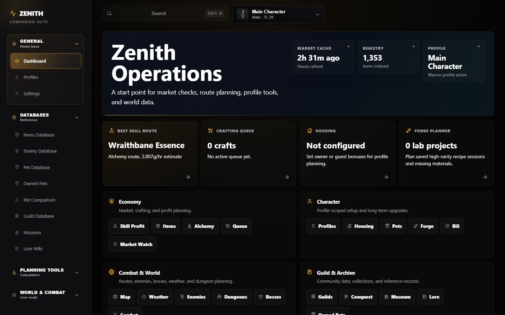

# Zenith Companion

  

<h1 align="center">Zenith Companion</h1>

  <strong>An unofficial IdleMMO companion suite for market intelligence, profile-aware planning, combat routing, and searchable game data.</strong>

  <a href="https://zenith-companion.vercel.app"><strong>Open the live companion</strong></a>

  
  
  
  

  

## What It Is

Zenith Companion is a focused companion app for IdleMMO players who want faster answers than a spreadsheet can usually give. It combines cached market data, item metadata, recipes, drops, pets, guilds, world bosses, weather windows, and local player profiles into one responsive interface.

The goal is practical decision support: what to craft, what to farm, which route is worth checking, which item is connected to a recipe or drop source, and what a profile needs next.

## Feature Tour

### Command Center

- A compact dashboard for jumping into active tools, profile status, market signals, and the most-used references.
- Global search across items, pages, tools, lore signals, recipes, enemies, bosses, pets, guild data, and generated indexes.
- Desktop sidebar, profile controls, and a mobile-first command experience designed for fast navigation instead of deep menu hunting.

### Economy And Profit Planning

- **Alchemy Profit** compares recipe cost, sell revenue, vendor revenue, net return, usage count, recent volume, and market confidence.
- **Mythic Lab** gives high-level recipes a project-style workspace with acquisition cost, material ledger, revenue strategy, thin-market warnings, and profit per craft.
- **Skill Profit Finder** evaluates tool, gear, essence, material, vendor, and market assumptions while keeping unknown prices visible instead of treating them as free profit.
- **Crafting Queue**, **Forge Planner**, **Housing**, **BiS Recommender**, and **Market Watch** keep longer planning flows tied to profile-specific assumptions.

### Databases And Item Intelligence

- **Item Database** indexes every known item with type, quality, level, market labels, vendor values, stable volume, recipe use, source links, and lore connections.
- **Enemy Database**, **Dungeon Database**, **Pet Database**, **Owned Pets**, **Pet Comparison**, **Guild Database**, **Museum**, and **Lore Wiki** connect reference data back into planning tools.
- Item detail views focus on relationships: where an item comes from, where it is used, whether it appears in recipes, and whether its market signal is reliable enough to act on.

### Profile-Aware Planning

- Local profiles keep character assumptions separate, including levels, gear, tools, pets, housing, imports, preferences, and page-specific planning state.
- The IdleMMO import flow uses visible public profile data and local confirmation, so nothing replaces a saved profile until the user accepts the result.
- Multi-tab import state is designed to be recoverable: a user can leave the profile page, return later, or open another tab without losing the current job state.

### World And Combat

- **World Map** and **Weather Guide** help users understand route, area, and event timing without manually checking every location.
- **Combat** keeps enemy EV and session planning separate so estimates stay transparent instead of pretending to be an exact simulator.
- **Dungeons** compare expected value, entry cost, profit per run, and expected runs per rare result.
- **World Bosses** combine boss schedule data with route planning and teleport-cost logic so users can compare travel decisions before the spawn window.
- **Conquest** tracks live-route style data in the same navigation family as the rest of the world and combat tools.

## Interface Preview

<table>
  <tr>
    <td width="50%">
      
    </td>
    <td width="50%">
      
    </td>
  </tr>
  <tr>
    <td width="50%">
      
    </td>
    <td width="50%">
      
    </td>
  </tr>
</table>

## Data Snapshot

Zenith Companion is built around generated, cached data rather than heavy runtime fetching. The current public snapshot includes:

| Area | Current indexed coverage |
| --- | ---: |
| Items | 1,353 |
| Market-tracked items | 833 |
| Enemies | 47 |
| Dungeons | 18 |
| World bosses | 11 |
| Pets | 46 |
| Global search entries | 1,439 |

The exact numbers move as the data pipeline discovers, refreshes, or normalizes more IdleMMO information.

## Architecture Snapshot

- **Frontend:** Next.js App Router, React, TypeScript, and hand-tuned CSS for dense dashboard-style workflows.
- **Generated data:** public JSON snapshots power item search, usage maps, lore signals, market data, pets, guilds, conquest, world bosses, and combat references.
- **Preprocessing-first design:** expensive linking, indexing, and normalization work happens before the app serves the page whenever possible.
- **Profile state:** player-specific assumptions stay local to the browser profile unless the user explicitly imports or exports data.
- **Automation:** GitHub Actions and scheduled refresh jobs keep generated data current without forcing the deployed app to refresh live data on every visit.
- **Deployment:** Vercel-hosted frontend with careful attention to static assets, bundle size, cached JSON, and free-tier friendly runtime usage.

## Quality Focus

Zenith Companion is treated as a real product rather than a quick calculator page. Ongoing checks include:

- TypeScript and lint checks for broken imports, runtime risks, and mismatched data contracts.
- Unit tests for shared calculation logic where formulas need regression protection.
- Playwright browser checks for page behavior, responsive layout, and key user flows.
- Accessibility reviews for keyboard navigation, focus management, labeling, contrast, target sizing, and mobile usability.
- Performance audits for hydration cost, client/server boundaries, generated-data size, render paths, caching, and bundle composition.

## Limits And Accuracy

Zenith Companion is unofficial and not affiliated with IdleMMO. It uses cached and generated data, so values can lag behind the live game or reflect incomplete public information. Profit, EV, route, and market recommendations should be treated as decision-support estimates, not guaranteed outcomes.

The app intentionally avoids asking users for an IdleMMO API key in the browser. Public profile import only uses visible profile information and keeps the final save step under user control.

## Roadmap

- Better first-run guidance using real screenshots and page-specific examples instead of generic text blocks.
- More resilient profile-import recovery, progress visibility, and mobile-safe background handling.
- Deeper combat confidence labeling as more formula evidence is verified.
- More preprocessing around item relationships, lore signals, and generated indexes to keep runtime costs low.
- Continued mobile navigation and accessibility polish without degrading the desktop planning workflow.

## Credits

Built by DevMohammed52 as a personal IdleMMO companion project, with testing and feedback from IdleMMO players who helped validate data, workflows, and real-use planning needs.

IdleMMO and its game assets belong to their respective owners. Zenith Companion is a fan-made, unofficial companion tool.
