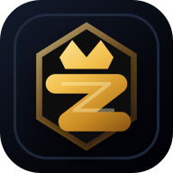
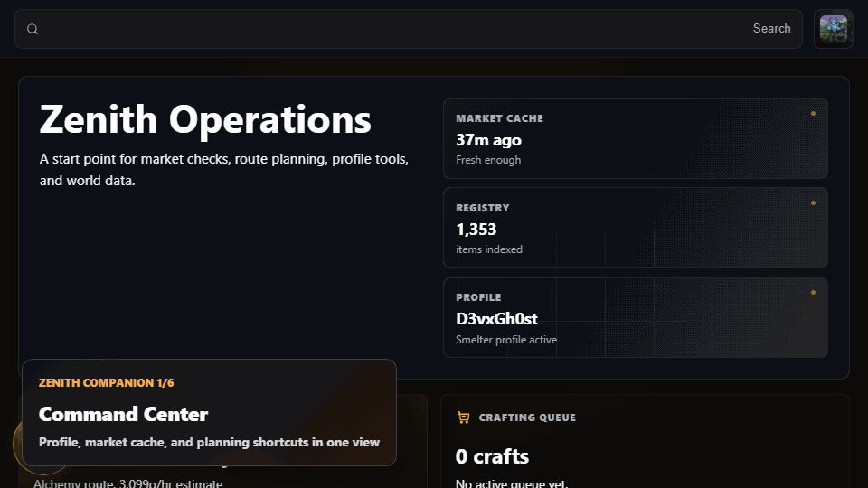
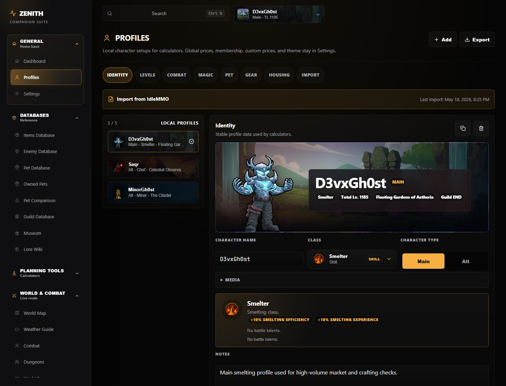
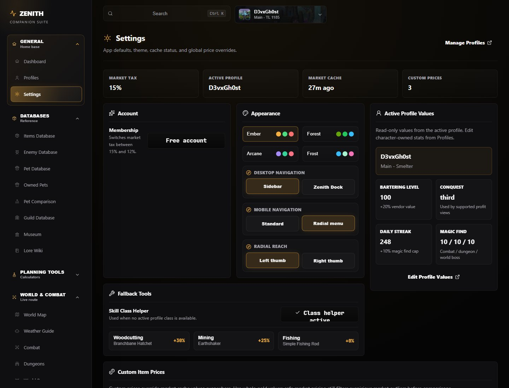
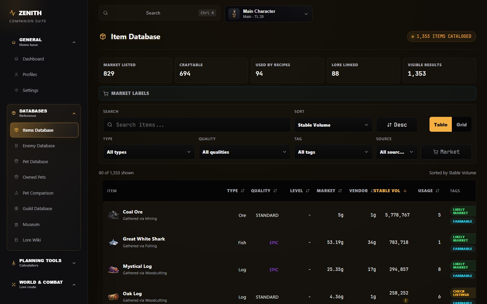
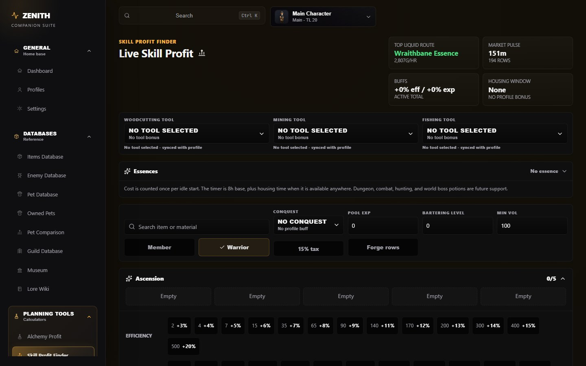
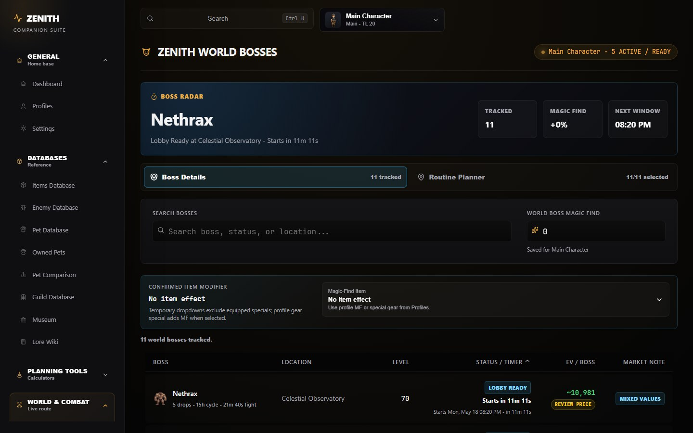
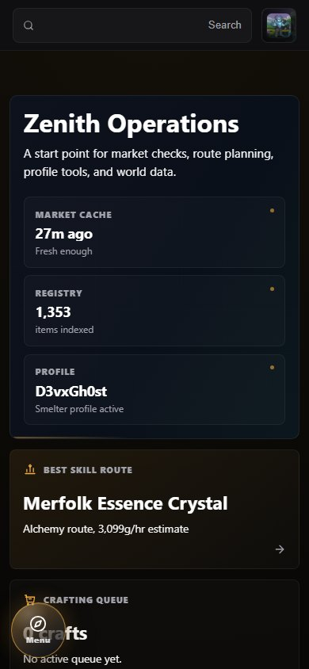
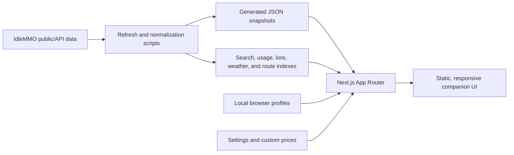

# Zenith Companion

  

<h1 align="center">Zenith Companion</h1>

  <strong>An unofficial IdleMMO companion suite for market intelligence, profile-aware planning, combat routing, world data, and searchable game knowledge.</strong>

  <a href="https://zenith-companion.vercel.app"><strong>Open the live companion</strong></a>

  
  
  
  
  

  

## Overview

Zenith Companion is a fan-made decision layer for IdleMMO. It brings together market snapshots, item metadata, recipes, enemies, drops, dungeons, world bosses, pets, guild data, weather windows, museum progress, and local character profiles into one fast interface.

The project started as an alchemy profit finder and grew into a full companion suite: part calculator, part database, part route planner, part character workspace.

## What Makes It Different

- **Profile-aware tools:** calculators read from the active local profile, including class, levels, bartering, conquest rank, tools, pets, housing, timers, magic find, and imported public character data.
- **Generated-data architecture:** expensive relationships are prebuilt into static JSON instead of recalculated on every page load.
- **Market caution built in:** thin markets, unknown prices, vendor fallbacks, stale snapshots, custom prices, and missing data are surfaced instead of hidden.
- **Connected reference pages:** items link to recipes, sources, drops, lore signals, bosses, dungeons, market labels, and usage maps.
- **Responsive product UI:** desktop has dense planning surfaces; mobile has compact navigation and a radial command option.
- **Free-tier minded:** the deployed app favors cached data, static assets, preprocessing, and minimal runtime work.

## Product Surfaces

| Area | What it does |
| --- | --- |
| Dashboard | Active profile summary, market cache status, quick access to economy, combat, world, guild, and archive tools. |
| Profiles | Local character workspaces for levels, combat stats, pets, gear, tools, housing, imports, and profile backups. |
| Settings | App-wide preferences, theme, navigation style, fallback tools, market tax mode, active profile values, and custom prices. |
| Item Database | Searchable item index with market labels, source links, vendor values, recipes, usage relationships, and lore connections. |
| Skill Profit Finder | Profile-aware skilling route estimates with tool, class, market, essence, vendor, and missing-price safeguards. |
| Alchemy Profit | Recipe cost, revenue, ROI, market confidence, volume, vendor fallback, and owned-material planning. |
| Mythic Lab | High-level recipe project planning with material ledger, uses remaining, price overrides, and thin-market warnings. |
| Crafting Queue | Batch planning for materials, profit, and queued craft sessions. |
| Forge Planner | Forge route and material planning tied to market and profile assumptions. |
| Housing | Home and guest-buff planning that feeds other profile-aware tools. |
| Market Watch | Vendor-value and near-vendor watchlists based on current profile assumptions. |
| Combat | Enemy EV and session planning without pretending uncertain combat formulas are exact. |
| Dungeons | Expected value, entry cost, rare-result expectations, and profile-sensitive dungeon planning. |
| World Bosses | Spawn schedule, boss value, route planning, travel cost, and magic-find assumptions. |
| Weather Guide | Weather windows and location/event timing in a mobile-friendly layout. |
| Pets | Pet database, owned-pet snapshots, comparison tools, battle stats, and collection context. |
| Guilds, Museum, Lore | Guild reference data, collection tracking, and lore/item relationship exploration. |

## Profile And Settings

Zenith is built around the idea that a calculator is only useful when it understands the character behind the calculation. Profiles are local, browser-scoped workspaces. They can hold manual values, imported visible IdleMMO data, and calculated fields side by side.

<table>
  <tr>
    <td width="50%">
      
    </td>
    <td width="50%">
      
    </td>
  </tr>
</table>

Profile values can influence:

- alchemy and mythic vendor value through bartering
- skill-profit routes through class, tools, timers, and conquest rank
- combat and dungeon assumptions through levels, stats, pet, magic find, and efficiency
- housing bonuses and guest buffs
- market-watch thresholds and custom item prices
- world boss planning through magic find and route assumptions

## Interface Preview

<table>
  <tr>
    <td width="50%">
      
    </td>
    <td width="50%">
      
    </td>
  </tr>
  <tr>
    <td width="50%">
      
    </td>
    <td width="50%">
      
    </td>
  </tr>
</table>

## Data Snapshot

Zenith Companion is driven by generated and cached data. Current public coverage includes:

| Dataset | Current indexed coverage |
| --- | ---: |
| Items | 1,353 |
| Market-tracked items | 833 |
| Search entries | 1,439 |
| Enemies | 47 |
| Dungeons | 18 |
| World bosses | 11 |
| Pets | 46 |

These numbers change as the data pipeline discovers, normalizes, and refreshes more game data.

## Architecture

The app is intentionally preprocessing-first:

- route, search, usage, lore, weather, and relationship data are prepared before the user opens the page
- public JSON snapshots keep runtime API usage low
- profile state stays in the browser unless the user exports it
- custom prices and assumptions are explicit
- heavy pages are designed around filtering and memoized derived views rather than repeated work

## Engineering Focus

Zenith Companion is maintained like a product, not a one-off calculator.

- **Type safety:** TypeScript models for profiles, preferences, imports, market rows, items, pets, and planning logic.
- **Validation:** profile imports are normalized before they touch local state.
- **Performance:** generated data, route-level tuning, browser benchmarks, and bundle checks guide changes.
- **Accessibility:** keyboard navigation, focus management, labeling, modal behavior, and mobile usability are reviewed as features evolve.
- **Testing:** static checks, unit tests, Playwright flows, accessibility checks, and page-by-page review notes are used during development.
- **Cost discipline:** the app is designed for public-repo automation, Vercel free-tier pressure, cached data, and minimal backend runtime.

## Boundaries

Zenith Companion is unofficial and not affiliated with IdleMMO.

It uses cached/generated data, so prices, routes, EV, and market labels can lag behind the live game or reflect incomplete public information. Profit and EV outputs are decision-support estimates, not guaranteed outcomes.

The app does not ask users to paste an IdleMMO API key into the browser. Profile import is built around visible public character information and a user-controlled save step.

## Roadmap

- Screenshot-based onboarding that explains the real UI instead of adding generic text noise.
- Stronger profile-import recovery and progress visibility for mobile users.
- More combat confidence labeling as formulas are verified.
- More generated indexes for lore, item descriptions, and source relationships.
- Continued mobile navigation polish without weakening desktop planning density.
- More route-level performance budgets as data volume grows.

## Credits

Built by DevMohammed52 as a personal IdleMMO companion project, with testing and feedback from IdleMMO players who helped validate data, workflows, and real-use planning needs.

IdleMMO and its game assets belong to their respective owners. Zenith Companion is a fan-made, unofficial companion tool.
